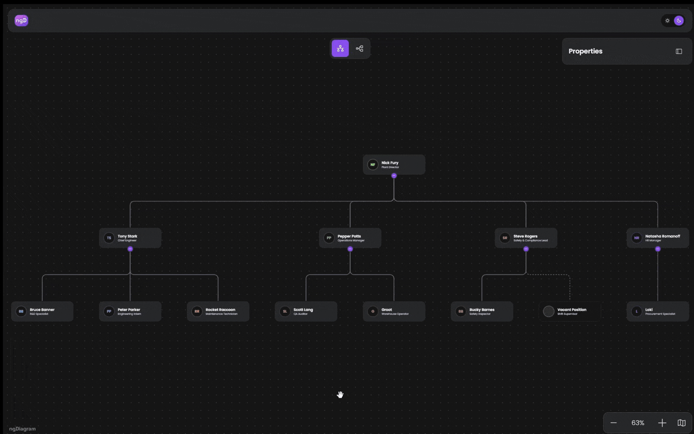

# ngDiagram Org Chart Template

[](https://opensource.org/licenses/MIT)

**Live demo:** [ngdiagram.dev/templates/org-chart](https://www.ngdiagram.dev/templates/org-chart/)



Interactive organizational chart built with Angular 21 and [ngDiagram](https://www.ngdiagram.dev/). Use this project as a starting point for building your own org-chart or tree-based diagram. Lean dependencies: Angular, ngDiagram, and ELK.js — no opinionated third-party UI libraries.

Features:

- Automatic tree layout powered by [ELK.js](https://www.npmjs.com/package/elkjs)
- Horizontal and vertical layout switching
- Expand/collapse subtrees with child count badge
- Drag-and-drop reordering (sibling and reparenting)
- Node creation and removal
- Minimap with zoom controls
- Animated layout transitions
- Three node display variants (full, compact, vacant)
- Color-coded roles with initials avatars
- Dark/light theme
- Properties sidebar demonstrating diagram-to-UI integration

## Getting Started

Built against Angular 21.2 and ngDiagram 1.3 (see `package.json`); Node.js 20.19+ or 22.12+ and npm 10+.

```bash
git clone https://github.com/synergycodes/ng-diagram-orgchart.git
cd ng-diagram-orgchart
npm install
npm start
```

Open [http://localhost:4200](http://localhost:4200) — a sample company of 13 people loads, laid out top-down. Try collapsing a subtree with the badge on a node, dragging one person onto another to change who they report to, and switching to the horizontal layout in the toolbar. The sample data lives in [`diagram/data.ts`](src/app/org-chart/diagram/data.ts) — replace it with your own.

## Scripts

| Command | Description |
|---|---|
| `npm start` | Start dev server with hot reload |
| `npm run build` | Production build to `dist/` |
| `npm run format` | Format code with Prettier |

## ngDiagram APIs Demonstrated

This template wires up most of the ngDiagram public surface, useful as a reference for which APIs to reach for in your own integration.

| Concern | API | Where in this repo |
|---|---|---|
| Bootstrap | `provideNgDiagram()` | `pages/org-chart-page.component.ts` |
| Diagram component | `<ng-diagram>` (`NgDiagramComponent`) | `diagram/diagram.component.html` |
| Background | `<ng-diagram-background>` (`NgDiagramBackgroundComponent`) | `diagram/diagram.component.html` |
| Minimap | `<ng-diagram-minimap>` (`NgDiagramMinimapComponent`), `MinimapNodeStyleFn` | `minimap-panel/minimap-panel.component.ts` |
| Custom node template | `NgDiagramNodeTemplateMap`, `NgDiagramNodeTemplate<TData>` interface | `diagram/diagram.component.ts`, `diagram/node/node.component.ts` |
| Custom edge template | `NgDiagramEdgeTemplateMap`, `NgDiagramEdgeTemplate<TData>`, `NgDiagramBaseEdgeComponent` | `diagram/edge.component.ts` |
| Connection ports | `<ng-diagram-port>` (`NgDiagramPortComponent`) | `diagram/node/node.component.html` |
| Model init | `initializeModel()` | `diagram/diagram.component.ts` |
| Model reads | `NgDiagramModelService` (`getNodeById`, `getEdgeById`, `getConnectedEdges`, `nodes()`, `edges()`, `getModel()`) | throughout `diagram/model/`, `drag-reorder/`, `properties-sidebar/` |
| Model writes | `NgDiagramModelService` (`addNodes`, `addEdges`, `deleteNodes`, `deleteEdges`, `updateNodes`, `updateEdges`, `updateNodeData`) | `diagram/model/model-apply.service.ts`, `properties-sidebar/node-mutation.service.ts` |
| Spatial query | `NgDiagramModelService.getNodesInRange(center, radius)` - find nodes within a pixel radius of a point | `drag-reorder/drag-reorder.service.ts`, `drag-reorder/drag.service.ts` |
| Atomic transactions | `NgDiagramService.transaction(..., { waitForMeasurements: true })` | `diagram/model/model-apply.service.ts` |
| Imperative event subscription | `NgDiagramService.addEventListener / removeEventListener` for events like `'nodeDragStarted'`, `'nodeDragEnded'`, `'selectionMoved'` | `drag-reorder/drag-reorder.service.ts` |
| Template-output event payloads | `DiagramInitEvent`, `SelectionGestureEndedEvent`, `SelectionRemovedEvent`, `NodeDragStartedEvent` | `diagram/diagram.component.ts`, `drag-reorder/drag.service.ts` |
| Viewport state | `NgDiagramViewportService` (`scale()`, `viewport()`) | `diagram/node/node.component.ts`, `diagram/animation/`, `diagram/node-visibility/` |
| Viewport actions | `NgDiagramViewportService` (`zoomToFit`, `zoom`, `moveViewport`) | `diagram/diagram.component.ts`, `minimap-panel/minimap-panel.component.ts`, `diagram/node-visibility/viewport.ts` |
| Selection | `NgDiagramSelectionService` (`selection()`, `select()`) | `properties-sidebar/properties-sidebar.service.ts`, `diagram/node/components/add-button/add-button.service.ts` |
| Config typing | `NgDiagramConfig` (linking, zIndex elevation, etc.) | `diagram/diagram.component.ts` |
| Core types | `Node<TData>`, `Edge<TData>`, `Point`, `Rect`, `Viewport` | throughout |

## Customizing for Your Project

### Configuration

All tunable values (animation speed, layout spacing, zoom behavior, drag thresholds) are centralized in a single config file:

**`src/app/org-chart/org-chart.config.ts`**

To override defaults, add `provideOrgChartConfig` to your page providers:

```typescript
import { provideOrgChartConfig } from './org-chart.config';

providers: [
  provideOrgChartConfig({
    animation: { durationMs: 500, layoutEnabled: false },
    layout: { nodeSpacing: 200 },
    viewport: { compactScaleThreshold: 0.5, zoomStep: 0.25 },
    drag: { detectionRange: 150 },
  }),
]
```

Unspecified values keep their defaults. See `OrgChartConfig` interface for all options with documentation.

### Data Model

Node and edge data interfaces are defined in `src/app/org-chart/diagram/model/interfaces.ts`. The base node data includes properties for tree behavior:

| Property | Purpose |
|---|---|
| `isCollapsed` | Whether the node's subtree is collapsed |
| `isHidden` | Whether the node is hidden (inside a collapsed subtree) |
| `hasChildren` | Whether the node has child nodes |
| `collapsedChildrenCount` | Cached descendant count for collapsed nodes |
| `sortOrder` | Sibling ordering within the tree |

Property names are exported as constants (e.g., `IS_COLLAPSED`, `HAS_CHILDREN`) from the same file. All reads go through getter functions in `data-getters.ts`, and all writes use bracket notation with these constants. To rename a property, change the constant value and the interface, no other files need updating.

### Node Variants

The node component (`src/app/org-chart/diagram/node/`) renders three visual variants:

- **full** - complete card with stats and capacity bar (zoom >= threshold)
- **compact** - header only (zoom < threshold, configurable via `viewport.compactScaleThreshold`)
- **vacant** - placeholder card for unfilled positions

To customize node appearance, edit the components in `src/app/org-chart/diagram/node/components/`.

### Adding Your Own Data

Replace the seed data in `src/app/org-chart/diagram/data.ts`. Each node needs:

- A unique `id`
- `type: 'orgChartNode'`
- `position: { x: 0, y: 0 }` (layout engine computes actual positions)
- A `data` object matching `OrgChartNodeData`

Edges connect nodes via `source`/`target` IDs with port names `'port-out'` and `'port-in'`.

### Theming

Theme is driven by the `data-theme` attribute on `<html>` (`"light"` or `"dark"`) and persisted in `localStorage`. The toggle UI lives in `src/app/org-chart/top-navbar/theme-toggle.component.ts`.

Color tokens are defined in `src/tokens.css`:

- **`--ngd-colors-*`** - base palette (grays + accent ramps `acc1`–`acc9` with shade and alpha variants).
- **`--ngd-role-*`** - role-to-color mapping consumed by node templates (e.g. `--ngd-role-plant-director`). Each role variable points at one of the palette colors, so swapping a role's color is a one-line edit.

Roles map to CSS variables via `getColorForRole()` and the `ORG_CHART_ROLE_COLORS` record in `src/app/org-chart/diagram/model/interfaces.ts`. To add a new role: extend the `OrgChartRole` enum, add a `--ngd-role-*` token, and add a row to `ORG_CHART_ROLE_COLORS`.

Global stylesheet entry point: `src/styles.css` (imports `tokens.css`, typography, and `ng-diagram/styles.css`).

### Layout Engine

Tree positions are computed by [ELK.js](https://www.npmjs.com/package/elkjs) using the `mrtree` algorithm. The integration is intentionally narrow:

- **`diagram/layout/perform-layout.ts`** - single ELK call site. Converts ngDiagram nodes/edges into ELK input, runs `elk.layout(...)`, and returns the same nodes with updated `position`. Also enforces a uniform node size across the layout (the cached max width/height across all runs) so spacing stays stable when the compact/full variants produce different sizes.
- **`diagram/layout/layout.service.ts`** - orchestration. Resolves the visible set (collapsed subtrees excluded), applies pending mutations from `ModelChanges` (deletions, edge-source overrides, new nodes, sort-order overrides), invokes `performLayout`, **pins the root** so the chart doesn't jump after re-layout, then writes position updates back into the same `ModelChanges` instance.
- **`diagram/layout/visible-set.ts`** - pure helpers: `getVisibleSet` (current), `getFutureVisibleSet` (predicted after a collapse/expand), `findRootNode`.

To swap ELK for another engine (d3-hierarchy, dagre etc.), replace `perform-layout.ts` with a function of the same shape:

```typescript
(nodes: Node[], edges: Edge[], direction: 'DOWN' | 'RIGHT', nodeSpacing: number) => Promise<Node[]>
```

`LayoutService` is the only caller, and it handles visibility / sort-order / root-pinning around the call, so a replacement only needs to assign positions.

`LayoutService` pre-sorts nodes and edges by `sortOrder` before invoking the engine, relying on the engine to honor that input order for siblings. ELK's `mrtree` does; other libraries may not. If the chosen engine doesn't preserve input order, the adapter can read each node's `sortOrder` (via `getSortOrder` from `model/data-getters.ts`) and pass it to the library in whatever ordering format it accepts.


## Architecture

### Service Hierarchy

All services are provided at the page component level (`OrgChartPageComponent`), no `providedIn: 'root'`. Drag-reorder services are scoped to the `DiagramComponent`.

```
OrgChartPageComponent (providers)
  ├── Layout: LayoutGate, LayoutService, LayoutAnimationService
  ├── Model: ModelApplyService, HierarchyService, SortOrderService,
  │          ExpandCollapseService, AddNodeService
  ├── UI: PropertiesSidebarService (→ NodeMutationService),
  │       NodeVisibilityService,
  │       NodeVisibilityConfigService
  ├── Node actions: AddButtonService
  └── DiagramComponent (providers)
      └── DragService, DropService, DragReorderService
```

### Key Patterns

- **Compute-then-apply mutations** - services build a `ModelChanges` accumulator (partial data patches allowed); `ModelApplyService` resolves patches against current state, runs layout and animation, and commits in a single `LayoutGate`-serialized transaction.
- **Centralized property keys + getters** - every node/edge data field has a string-constant key (`IS_COLLAPSED`, `HAS_CHILDREN`, …) and a getter in `data-getters.ts`. Renames touch one constant + the interface; no callsites.
- **Viewport overlays** - `appViewportBounds` / `appViewportOverlay` directives register UI elements that obscure the diagram so visibility calculations account for them.

## Project Structure

```
src/app/org-chart/
├── org-chart.config.ts                 # Central configuration
├── pages/                              # Page container
├── diagram/
│   ├── diagram.component.ts            # Main diagram component
│   ├── edge.component.ts               # Edge template
│   ├── data.ts                         # Seed data
│   ├── model/                          # Domain types & services
│   │   ├── interfaces.ts               # Data types + property key constants
│   │   ├── data-getters.ts             # Centralized property accessors
│   │   ├── model-changes.ts            # Change accumulator
│   │   ├── model-apply.service.ts      # Applies changes with layout
│   │   ├── hierarchy.service.ts        # Parent-child relationships
│   │   ├── expand-collapse.service.ts  # Subtree visibility
│   │   ├── sort-order.service.ts       # Sibling ordering
│   │   └── add-node.service.ts         # Node creation
│   ├── node/                           # Node rendering (3 variants)
│   ├── layout/                         # ELK.js layout engine
│   ├── animation/                      # Layout + viewport animations
│   └── node-visibility/                # Viewport-aware visibility
├── drag-reorder/                       # Drag-and-drop subsystem
│   ├── zone-detection/                 # Drop zone strategies
│   └── drop-strategy/                  # Drop action strategies
├── properties-sidebar/                 # Node editing panel
├── shared/                             # Reusable UI (combobox, avatar)
├── top-navbar/                         # Navigation bar + theme toggle
├── toolbar-horizontal/                 # Layout direction toolbar
└── minimap-panel/                      # Minimap with zoom controls
```

## Tech Stack

- **Angular 21** - standalone components, signals, OnPush change detection
- **ngDiagram** ([`ng-diagram`](https://www.npmjs.com/package/ng-diagram) on npm) - diagram rendering, viewport management, selection
- **ELK.js** - automatic tree layout
- **Prettier** - code formatting

## Known ngDiagram Issues

The template contains a few workarounds and compromises driven by current library gaps. Resolving these would let us simplify the template.

### Issues with workarounds in this repo

- **No API for hiding a node.** ngDiagram wraps each custom node in a `.node-content` div that intercepts pointer events, so hiding the custom node alone isn't enough. *Workaround:* `::ng-deep` CSS in `node.component.scss` reaches up to the wrapper to suppress both visibility and pointer events. A first-class hidden-node property would remove the `::ng-deep` entirely.

### Issues without workarounds (felt by end users)

- **Resize batch re-runs edge routing per node.** When many nodes change size at once (for example, 500 nodes switching between compact and full variants on a zoom threshold), edges visibly disconnect from their nodes for roughly one to two seconds before snapping back.
- **Layout animation is naive in the template.** The animation implementation in this template is fairly naive. Proper native animation support in ngDiagram is needed so the template can drop its custom animation code. If you notice lag from animations, you can turn them off by passing `animation: { layoutEnabled: false }` to `provideOrgChartConfig` (see "Configuration" above).

All of the above are the highest-priority items for the team to fix in ngDiagram. That said, the template works today and is fully usable as-is.

## ngDiagram Documentation

For comprehensive ngDiagram documentation, examples, and API reference, visit: **[ngdiagram.dev/docs](https://www.ngdiagram.dev/docs)**

Related reading: **[Building an org chart with ngDiagram — a hands-on write-up](https://dev.to/ngdiagram-dev/ive-used-gojs-for-years-heres-what-happened-when-i-built-an-org-chart-with-ngdiagram-1gkn)** on dev.to, by a developer coming from another diagram library: the brief, the build, and the trade-offs.

## Support

- **Issues**: [GitHub Issues](https://github.com/synergycodes/ng-diagram-orgchart/issues)
- **Discussions**: [GitHub Discussions](https://github.com/synergycodes/ng-diagram-orgchart/discussions)
- **ngDiagram Discussions**: [GitHub Discussions](https://github.com/synergycodes/ng-diagram/discussions), [Discord](https://discord.gg/FDMjRuarFb)
- **ngDiagram Documentation**: [ngdiagram.dev/docs](https://www.ngdiagram.dev/docs)

## License

MIT — see [LICENSE](LICENSE).

---

Built with ❤️ by the [Synergy Codes](https://www.synergycodes.com/) team
